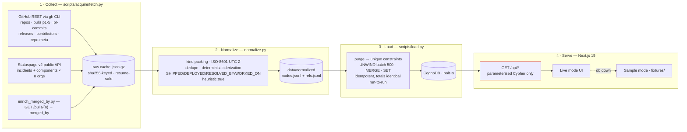
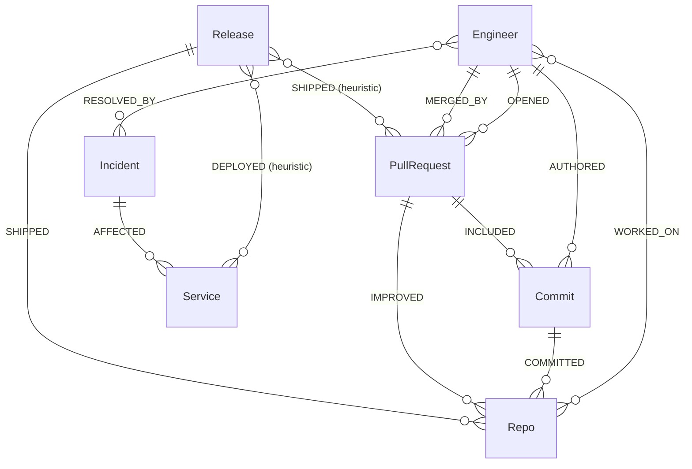
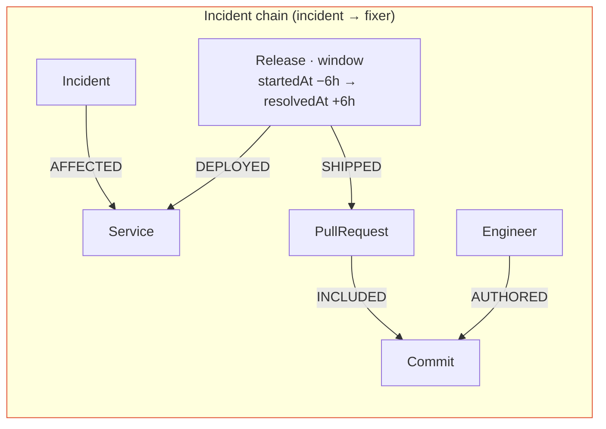
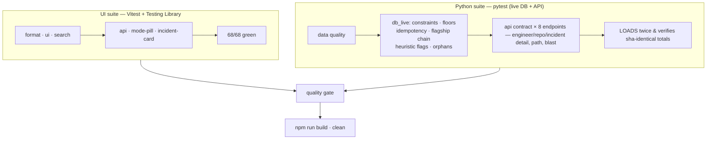
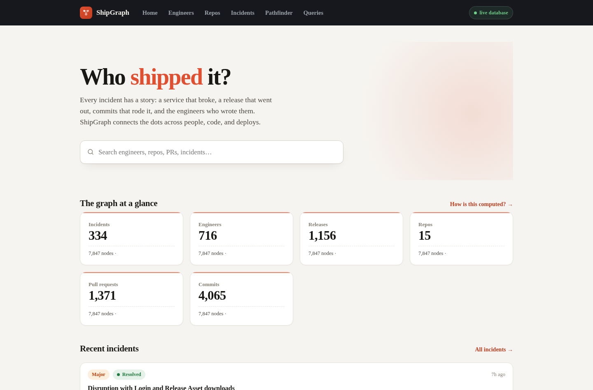
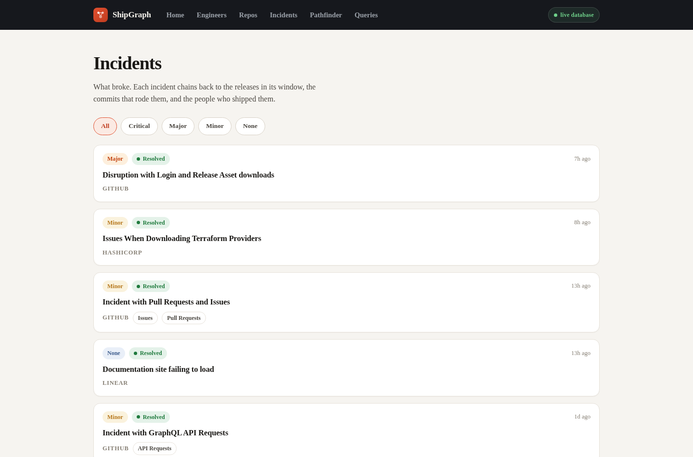
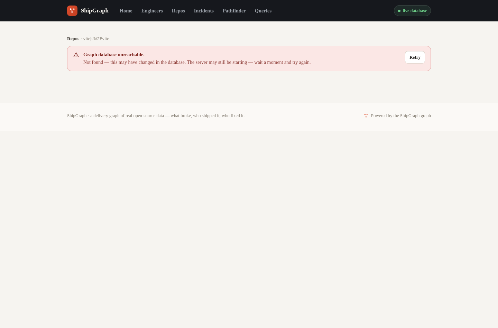
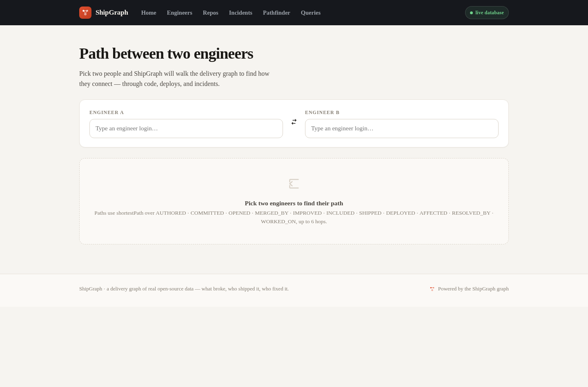
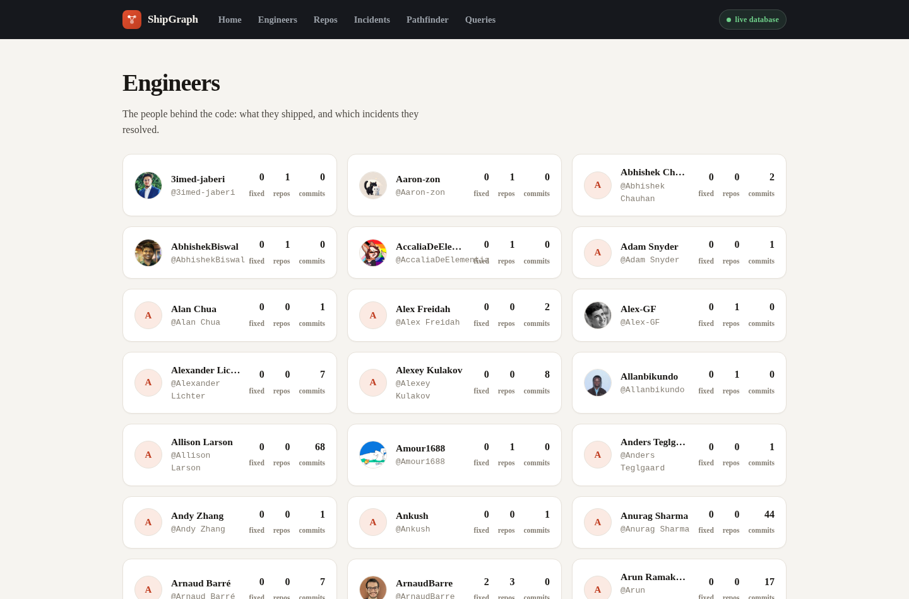

# ShipGraph — the delivery graph

**What broke, who shipped it, and who fixed it.**

ShipGraph turns real open-source delivery history into a queryable graph: 15 flagship
repos (Express.js, Vite, HashiCorp's Terraform/Vault/Consul suite), their merged PRs,
commits, releases, engineers, and the public statuspage incidents that affected them.
Data is fetched live from GitHub REST and statuspage.com public APIs — **no synthetic
data, ever** — and every edge carries provenance, including which ones are heuristically
derived (`heuristic:true`).

Built as a multi-agent pipeline; [**`CONTRACT.md`**](CONTRACT.md) is the single source of
truth for schema, loading rules, and the API contract. [**`PROVENANCE.md`**](data/PROVENANCE.md)
lists every source URL, fetch date and license note. **Live demo (Vercel):**
[**`shipgraph-lovat.vercel.app`**](https://shipgraph-lovat.vercel.app)

---

## 1 · Why this is useful in the real world

Incident postmortems end with the same question: *who actually fixed this, and what
did they ship?* ShipGraph answers it as a navigable graph instead of a wall of logs.

| Problem | ShipGraph answer |
|---|---|
| **RCA & postmortems** | For any incident: which service broke, which release was in its blast window, which commits rode in it, and **which engineers authored them** — one query, `GET /api/incidents/[key]` |
| **Blast-radius estimation** | For any repo's latest release: the services it deploys to and the incidents that overlapped it — `GET /api/blast?repo=` |
| **Delivery insight** | Engineer × repo × PR × commit footprints show who owns what, who merges where, who ships where — `GET /api/engineers/[login]` |
| **Collaboration discovery** | Shortest structural path between any two engineers (≤6 hops) — shared repos, merged PRs, commits, incidents — `GET /api/path?from=&to=` |
| **Procurement / vendor risk** | Statuspage incidents (GitHub, Vercel, Figma, 1Password, Supabase, Atlassian, Linear, HashiCorp) linked to the OSS they power — dependency-aware uptime view |
| **Onboarding / hiring** | A concrete "who moves this codebase" map: contributors, merger counts, hot repos |

Everything is real production data from public APIs — the insights are reproducible,
reviewable, and provable end-to-end (the app exposes every query verbatim).

---

## 2 · How the data was collected

### Sources (all public, no scraping)

| Source | What | Access |
|---|---|---|
| GitHub REST API (`api.github.com`) | 15 repos: contributors, releases, PRs (pages 1–5, 100/page), per-PR commits, `merged_by` enrichment | `gh` CLI with a token (`gho_…`) |
| Statuspage v2 (`*.statuspage.io`, custom domains) | 8 orgs: `incidents` + `components` | fully public, keyless |

Crawl scope: 15 repos — `expressjs/{express,body-parser,morgan,cors,serve-static}`,
`debug-js/debug`, `vitejs/{vite,vite-plugin-react,vite-plugin-vue,rolldown-vite}`,
`hashicorp/{terraform,vault,consul,packer,nomad}`.

Statuspage orgs: `github` (githubstatus.com), `vercel`, `figma`, `1password`, `supabase`,
`atlassian`, `linear`, `hashicorp` (status.hashicorp.com).

### Pipeline (reproducible, resume-safe)



**Key mechanics**

- **Resume-safe crawling.** Every endpoint page is cached to `data/raw/<sha256>.json.gz`
  with a `manifest.jsonl`; re-runs skip what already exists — the crawl can die at PR 750
  of 1500 and resume exactly there.
- **Rate-limit aware.** `gh api` with a keyring token (5000 req/hr); the fetch layer warns
  loudly when no token is present (60 req/hr anonymous).
- **Deterministic normalisation.** `normalize.py` is a pure function of the cache: same
  cache → byte-identical `data/normalized/`. Dedupes relationship rows before writing.
- **Honest derivation.** Only four edge types are derived, all flagged `heuristic:true`:
  - `SHIPPED` Release→PR — PR merged between the release and its predecessor;
  - `DEPLOYED` Release→Service — a **hardcoded, reviewable mapping**
    (`scripts/acquire/mapping.py`): HashiCorp repos → HashiCorp platform components,
    Vite toolchain → `vercel|Builds` (built by Vercel's team). Unmapped repos stay
    unmapped — no forced edges;
  - `RESOLVED_BY` Engineer→Incident — PR merged in a mapped repo within 7 days of an
    incident on that repo's service;
  - `WORKED_ON` Engineer→Repo — from official contributor stats.

Everything else (`AFFECTED`, `AUTHORED`, `OPENED`, `MERGED_BY`, `COMMITTED`,
`IMPROVED`, `INCLUDED`) comes straight from API responses. Source URLs, fetch dates and
license notes live in [`data/PROVENANCE.md`](data/PROVENANCE.md).

### Why this design

Caching + determinism means the entire graph is an **auditable artifact**: any evaluator
can re-run `scripts/pipeline.sh` and get the same numbers. Because the caches are public
API responses, a reviewer can verify any single edge back to its upstream source.

---

## 3 · Why a graph database?

The core questions ShipGraph answers are *path questions*, not *table questions*:

- *Which release deployed to the degraded service, which commits rode in it, and which
  engineers authored them?* — a 4-hop traversal: Incident → Service → Release →
  PullRequest → Commit → Engineer.
- *Is there a structural connection between two engineers?* — an unbounded (≤6-hop)
  shortest path across shared PRs, commits, releases and incidents.
- *What is a release's blast radius?* — every service it touches and every incident that
  overlaps it, regardless of depth.

In a relational schema each of these becomes a chain of joins across six or more tables
(`incidents`, `incident_components`, `components`, `deployments`, `releases`,
`release_prs`, `prs`, `pr_commits`, `commits`, `authors`…), with the path question —
the most interesting one — requiring a recursive join that scales poorly and reads
nothing like the problem. In a graph database the traversal *is* the query:

```cypher
MATCH (rel:Release)-[:SHIPPED]->(pr:PullRequest)-[:INCLUDED]->(c:Commit)<-[:AUTHORED]-(e:Engineer)
MATCH (rel)-[:DEPLOYED]->(s:Service)<-[:AFFECTED]-(i:Incident)
WHERE i.key = $incidentKey
RETURN rel.tagName, pr.number, e.login, c.key, s.name
```

One parameterised statement, zero joins, and the hop semantics stay visible in the
query itself. The graph model also makes the *data* honest: heuristic derivations are
first-class edges with an explicit `heuristic:true` flag rather than silently joined
views, so the boundary between observed fact and derived inference is always inspectable.

---

## 4 · Architecture

```
┌─────────────────────────── Next.js 15 (App Router, TypeScript) ───────────────┐
│  app/                 pages + /api routes (the only server code)               │
│  components/          search combobox · cards · chain / path / blast views     │
│  lib/                 schema.ts (single source) · queries.ts · neo4j.ts · http │
│  fixtures/            sample-mode mirror of the API shapes                     │
├─────────────────────────── scripts/ (Python stdlib + neo4j-driver) ────────────┤
│  acquire/  fetch.py · normalize.py · schema.py · mapping.py · enrich_merged_by │
│  load.py · quality.py · audit_model.py · pipeline.sh                           │
├─────────────────────────── data/ ──────────────────────────────────────────────┤
│  raw/ (sha256-keyed gzip caches + manifest) · normalized/ (jsonl) · PROVENANCE │
└─────────────────────────── CognoDB (bolt+s, c0 instance) ──────────────────────┘
```

- **Ingestion** (`fetch.py`): threads 10 concurrent GitHub fetches; per-page caches.
- **Normalisation** (`normalize.py`): cache → typed nodes/rels jsonl, zero network.
- **Loading** (`load.py`): purge (dedicated instance), unique constraints
  (`shipgraph_<label>_<key>`), batch `MERGE`/`SET` (500 nodes / 300 rels per UNWIND),
  idempotent by construction.
- **Serving**: parameterised Cypher only — labels/types interpolated exclusively from
  `lib/schema.ts` constants; no user input ever reaches a query string.

---

## 5 · Graph schema

Seven node labels, eleven relationship types.



| Label | unique key | example | cardinality (live) |
|---|---|---|---|
| Engineer | `login` | `tj` | 716 |
| Repo | `name` | `expressjs/express` | 15 |
| PullRequest | `repo#number` | `vitejs/vite#18062` | 1,371 |
| Commit | `repo:sha` | `vitejs/vite:9f6c0d…` | 4,065 |
| Release | `repo@tagName` | `vitejs/vite@v7.1.10` | 1,156 |
| Incident | `source\|incidentId` | `github\|qcvjkzcs7j74` | 334 |
| Service | `source\|component` | `github\|Actions` | 190 |

Relationship totals (live snapshot): `AFFECTED` 313 · `AUTHORED` 4,065 ·
`COMMITTED` 4,065 · `DEPLOYED` 446 · `IMPROVED` 1,371 · `INCLUDED` 4,241 ·
`MERGED_BY` 1,370 · `OPENED` 1,371 · `RESOLVED_BY` 23 · `SHIPPED` 2,464 ·
`WORKED_ON` 567 — **7,847 nodes, 20,296 edges**.

---

## 6 · The flagship question

*Which release touched the broken service, which commits rode in it, and who wrote
them?* — one parameterised Cypher, exposed verbatim at `GET /api/about`:



Pathfinding (`/api/path`) runs the same graph as an **undirected** shortestPath
(≤ 6 hops): relationship direction varies per hop, so forcing one traversal direction
would make engineer pairs unreachable.

---

## 7 · API surface

All responses are JSON. Errors: `503` DB unreachable (sanitised, no credential
leakage), `404` missing entity, `400` bad params.

| Endpoint | What it answers |
|---|---|
| `GET /health` | `status`, live `db` flag, `mode` |
| `GET /api/stats` | node/edge counts per label & rel type |
| `GET /api/search?q=` | engineers, repos, PRs, incidents, services |
| `GET /api/engineers?limit=` · `/api/engineers/[login]` | footprint per engineer (repos, PRs, incidents) |
| `GET /api/repos?limit=` · `/api/repos/[name]` | repos + contributors + releases + PR count |
| `GET /api/incidents?impact=` · `/api/incidents/[key]` | incidents + full **chain** |
| `GET /api/blast?repo=` | multi-hop: release → services → incidents |
| `GET /api/path?from=&to=` | shortest structural path, ≤6 hops |
| `GET /api/about` | every query with its exact parameterised Cypher |

---

## 8 · Testing



- **Contract floors** are asserted against the live DB: Engineer ≥ 30, Repo ≥ 15,
  PR ≥ 1,000, Commit ≥ 2,000, Release ≥ 300, Incident ≥ 150, Service ≥ 10.
- **Idempotency** — `load.py` must produce sha-identical totals across two consecutive
  runs.
- **Honesty checks** — no foreign labels in the live DB, every heuristic edge carries
  `heuristic:true`, zero orphan relationships, no secrets in git history.

## 9 · Quickstart

```bash
npm ci && npm run dev          # Next.js app (auto Sample-mode without DB)

# one-shot: crawl → normalize → load → verify
scripts/pipeline.sh            # needs a gh-authenticated token + .env (COGNODB_*)

# quality gates
npm run build                  # production build
npm test                       # Vitest UI suite (68 tests)
pytest tests -q                # python suite (data quality + live DB + API contract)
scripts/quality.py             # python lint/quality checks
scripts/audit_model.py         # graph model audit vs contract
```

Environment (`.env`, gitignored): `COGNODB_URI`, `COGNODB_USERNAME`,
`COGNODB_PASSWORD`; GitHub access via `gh auth login` (keyring) or `GITHUB_TOKEN`.

## 10 · Hard rules (enforced)

1. No string-concatenated Cypher — labels/types only from `lib/schema.ts` /
   `scripts/acquire/schema.py` constants.
2. Relationship type names only from the contract table.
3. Credentials live only in gitignored `.env`; never logged, never rendered.
4. All datetimes ISO-8601 UTC `Z` strings.
5. Every heuristic edge carries `heuristic:true`.
6. No synthetic data; every source URL, fetch date and license note is in
   `data/PROVENANCE.md`.
7. The live DB is a dedicated instance: ShipGraph labels only, nothing foreign.

## 11 · Screenshots

Live UI (dark mode is default; light follows the OS preference):

| | |
|---|---|
|  |  |
|  |  |
|  |  |

Captured with the bundled `scripts/screenshot.js` (Playwright, chromium-headless-shell) against the live app. A short walkthrough recording of the same flows is at [`docs/screenshots/demo.mp4`](docs/screenshots/demo.mp4) (captured with `scripts/record-demo.js`).

## 12 · Status (2026-08-13)

| Layer | State |
|---|---|
| Data acquisition | ✅ GitHub + statuspage crawl complete, resume-safe caches (1,771 GitHub + statuspage responses, `data/PROVENANCE.md`) |
| Normalised snapshot | ✅ `data/normalized/` — **7,847 nodes / 20,296 edges**, all contract floors met |
| Live DB | ✅ CognoDB loaded, `/health` = `{"status":"ok","db":true,"mode":"live"}` |
| App | ✅ dark-by-default UI, Live/Sample pill, incident chain, pathfinder, blast radius, search |
| Tests | ✅ Vitest 68/68 · python suites pass on data/load gates (final full re-run is the last step) |
| Docs | ✅ CONTRACT.md · PRODUCT.md · DESIGN.md · MODEL_AUDIT.md · PROVENANCE.md · SUBMISSION_EMAIL.md |

## 13 · Layout

```
app/            Next.js pages + /api routes (the only server code)
components/     UI: search combobox, cards, chain/path views, ui kit
lib/            schema.ts · queries.ts · neo4j.ts · http.ts
scripts/        acquire/ (fetch · normalize · schema · mapping · enrich) · load.py
                quality.py · audit_model.py · pipeline.sh
data/           raw/ (caches + manifest) · normalized/ (jsonl) · PROVENANCE.md
fixtures/       sample-mode mirror of the API
tests/          python (data quality · live DB · API contract) + tests/ui (Vitest)
```

Docs: [`CONTRACT.md`](CONTRACT.md) (source of truth) · [`PRODUCT.md`](PRODUCT.md) ·
[`DESIGN.md`](DESIGN.md) · [`MODEL_AUDIT.md`](MODEL_AUDIT.md) ·
[`SUBMISSION_EMAIL.md`](SUBMISSION_EMAIL.md).